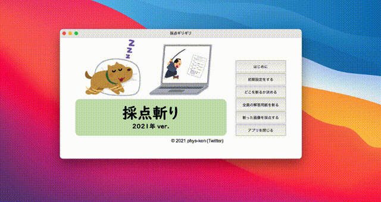
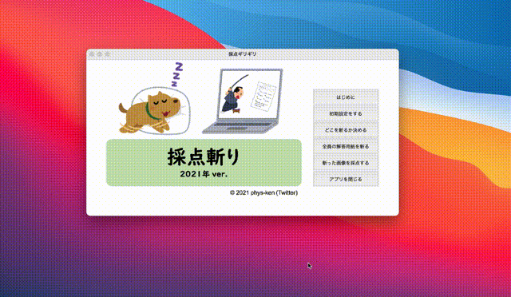
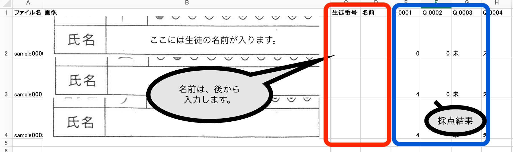
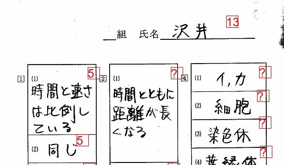

# 採点斬り 2021バージョン(β版)

### 作者
* 公立高校教員(理科・物理)
* Twitterのリンクは[こちら](https://twitter.com/phys_ken)
* Qiitaのリンクは[こちら](https://qiita.com/phys-ken)

## はじめに
* 竹内俊彦氏作成の[採点革命](http://www.nurs.or.jp/~lionfan/freesoft_45.html)や島守睦美氏作成の[採点斬り](http://www.nurs.or.jp/~lionfan/freesoft_49.html)などの素晴らしいフリーソフトを参考に、現在の環境でも動く同様のソフトを作成しました。
* フリーソフトですが、著作権は放棄しません。
* 転載、再配布は自由ですが、バグ対応等もあるので、現在のページ (https://phys-ken.github.io/saitenGiri2021/) へのリンクを貼ってください。
* 無断で改造、商用利用は認めていません。
* なお、このソフトウェアの使用によって生じた一切の損害について責任を負わないものとし、フリー版・シェアウェア版を問わず、個別のバグ対応は一切行いませんのでご注意下さい。
* とは言っても、バグの報告をいただけた場合にはできる限り対応します。[TwitterのDM](https://twitter.com/phys_ken)か、Githubのissueにあげてください。

## 使い方
1. このページ右上のダウンロードボタンか、[Release](https://github.com/phys-ken/saitenGiri2021/releases)のページから、最新版をダウンロードしてください。`dist_XXX`フォルダの中身が、アプリになります。
1. Windowsだと**採点斬り2021.exe**、Macだと**saitenGiri2021**がソフト本体になります。インストール等は不要なので、お好みの場所にソフトを保存してください。
1. 採点斬りを起動してください。
    1. windowsの場合は、ダブルクリックしてください。
    1. macの場合は、ターミナルでアプリが保存されているフォルダに移動してから、`./saitenGiri2021`で起動してください。ダブルクリックだと、うまく起動されません。
1. 初期設定ボタンを押してください。同じ場所に、settingフォルダが展開されます。
1. 解答用紙を、`./setting/input`に保存してください。
    1. 練習用の画像を、`test_fig`の中に入れています。これは、元の採点斬りのサンプルを利用させていただいています。
3. 斬る範囲を決めてください。(1枚目の解答用紙がロードされます。)
    1. １か所目は名前、２か所目以降は回答部分になります。
    1. 範囲を決める際は、実寸で0.5cm程度余白があるように選択すると、スキャン時の微妙なブレにも対応できると思います。
    1. 決まったら、**入力終了**を押してください。
4. 斬ります。裏側で動作しています。進み具合が気になる場合は、こっそり起動しているターミナルをみると、進捗のログが表示されています。
    1. このタイミングで、裏では`saiten.xlsx`が作成されています。
5. いよいよ採点です。ver.3.0以降は、画面が少し見やすくなっています。...
    1. 点数をキーボードの数字キーで入力します。
    1. 矢印キーで、`次へ進む・前に戻る`ができます。
    1. `shift` や `Enter` を押すと、`skip` できます。`skip`とした項目は採点ボタンを押しても採点されず、次回選択時にまた出てきます。
    1. **採点実行**を押すと、得点をつけた項目が採点され、`setting/output`の中にある`saiten.xlsx`も更新されます。
        1. `saiten.xlsx`を起動している状態で**採点実行**をすると、動作がクラッシュします。
6. **Excelに出力**を押して、`saiten.xlsx`を作成します。 
7. **採点済み画像を出力**で、採点結果を出力します。
    1. 未採点の項目は`?`と表示させています。合計点は、`?`を無視して計算します。

## Q&A
* 画面が**応答なし**になる、フリーズか時間がかかっているだけなのか区別がつかない。
  * 裏で起動しているコンソール(文字だけの画面)に、進捗が表示されています。そちらを見てください。
* 一回採点した内容を、もう一度確認したいときは？
  * 採点の点検機能が実装できませんでした。`setting/output/Q_000X`の中に、配点ごとにフォルダが作成されています。お手数ですが、自分でフォルダ内を漁って、画像ファイルを`setting/output/Q_000X`の直下に保存して、再度採点をしてください。
  * 多分、フォルダのプレビューで一括表示した方が見やすいと思います。

## 今後の計画
* UIをもっとわかりやすくしたいと思っています。

## 参考にしたサイト等
* [【Python】簡易的な仕分け機能付き画像ビューワー作ってみた](https://qiita.com/hisakichi95/items/84b73ba14731bc68608a)
* [【python】マウスドラッグで画像から範囲指定する](https://qiita.com/hisakichi95/items/47f6d37e6f425f29c8a8)
* [How to make a tkinter canvas rectangle transparent?](https://stackoverflow.com/questions/54637795/how-to-make-a-tkinter-canvas-rectangle-transparent/54645103)
* [【python, pyinstaller】画像や音楽などの外部ファイルも一括でexe化して配布する](https://msteacher.hatenablog.jp/entry/2020/06/27/170529)