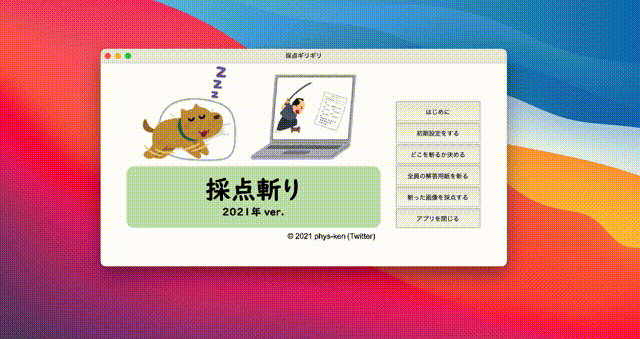
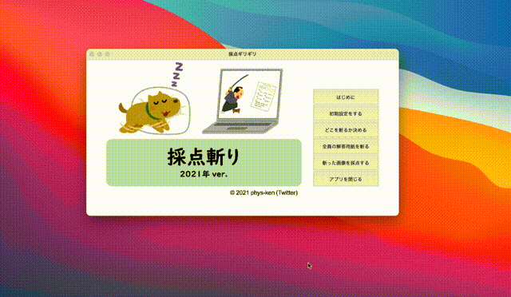
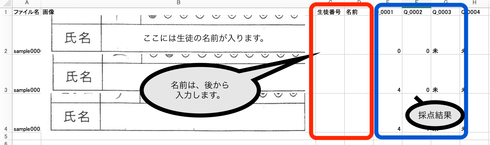
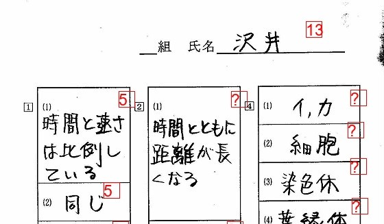
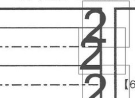

# 採点斬り2021 ユーザーマニュアル

**このマニュアルをお読みいただく前に、下部のQ&Aや過去のトラブル一覧もご確認ください。**

## はじめに
採点斬り2021は、学校の定期試験や小テストの採点作業を効率化するためのソフトウェアです。スキャンした解答用紙から特定の領域を切り出し、採点結果を管理することができます。

## インストール方法

インストールは不要です。以下の手順で実行できます：

1. [公式ページ](https://phys-ken.github.io/saitenGiri2021/)または[GitHub Releases](https://github.com/phys-ken/saitenGiri2021/releases)から最新版をダウンロード
2. ダウンロードしたZIPファイルを解凍
3. 解凍した`dist_XXX`フォルダ内のアプリを起動:
   - Windows: **採点斬り2021.exe**をダブルクリック
   - Mac: ターミナルで`./saitenGiri2021`を実行（ダブルクリックでは起動しません）

## 基本的な使い方

### 1. 初期設定
1. アプリを起動後、「初期設定」ボタンを押します
2. 同じ場所に`setting`フォルダが作成されます

### 2. 解答用紙の準備
1. スキャンした解答用紙画像を`setting/input`フォルダに保存します
   - テスト用の画像は`test_figs`フォルダにあります

### 3. 採点領域の設定

1. 「斬る範囲を決める」ボタンをクリック
2. 表示された解答用紙の上で:
   - 最初の選択領域は「氏名欄」となります
   - 2つ目以降の選択領域は「回答部分」となります
   - マウスでドラッグして範囲を指定します
   - 実寸で0.5cm程度余白を取るようにすると良いです
3. 範囲設定が完了したら「入力終了」をクリック

### 4. 採点準備
1. 「斬ります」ボタンをクリック
2. 裏で処理が実行されます（進捗はターミナルで確認可能）
3. この時点で`saiten.xlsx`が作成されています

### 5. 採点作業

1. 設問ごとに回答画像が表示されます
2. 点数の入力方法:
   - キーボードの数字キーで得点を入力
   - 矢印キーで「次へ進む・前に戻る」
   - `Shift`または`Enter`キーで項目をスキップ
3. 「採点実行」ボタンを押すと:
   - 得点が記録されます
   - `setting/output`内の`saiten.xlsx`が更新されます
   - ※ Excel ファイルを開いた状態で採点実行するとクラッシュします

### 6. 結果の出力
1. 「Excelに出力」ボタンを押して最終的な`saiten.xlsx`を作成
   
2. 「採点済み画像を出力」で採点結果を視覚的に確認
   
   - 未採点の項目は「?」と表示されます
   - 合計点は「?」を無視して計算されます

## Q&A

* **Q: 画面が「応答なし」になる、フリーズしているのか判断できない**
  * A: 裏で起動しているコンソール(文字だけの画面)に進捗が表示されています。そちらを確認してください。

* **Q: 一度採点した内容を再確認するには？**
  * A: `setting/output/Q_000X`フォルダ内に、配点ごとにフォルダ分けされた画像があります。確認したい画像を`Q_000X`の直下に移動して、再度採点を行ってください。フォルダのプレビュー機能で一括表示すると便利です。

* **Q: 採点結果の画像がグレースケールになる**
  * A: 画像の最適化処理により、元画像が高画質・大容量の場合にグレースケール化されることがあります。元画像のファイルサイズを小さくすると解決する場合があります。

* **Q: 画像処理に時間がかかる**
  * A: 問題数が多いと処理時間が増加します。元画像の画質を下げる、グレースケールで保存する、他のアプリを同時に使用しないなどの対策が有効です。

* **Q: 採点結果の得点表示が重なる**
  
  * A: 採点時の文字サイズは氏名欄の高さの半分に設定されています。氏名欄が高すぎると文字が重なることがあります。氏名欄の高さを解答欄と同程度にすると解決します。

## サポートとフィードバック

* バグの報告や機能リクエストは[TwitterのDM](https://twitter.com/phys_ken)またはGitHubのIssueでお知らせください。
* 詳細な解説は[Qiita記事](https://qiita.com/phys-ken/items/4fac021504d7fe6b98b2)をご覧ください。

## 関連ソフト

* [採点斬り2021-マルバツ](https://phys-ken.github.io/saitenGiri2021-marubatu/) - 採点結果の用紙に○×△の記号を付けるための拡張ソフト
* [ウラオモテヤマネコ](https://phys-ken.github.io/uraomoteYamaneko/) - 両面スキャンデータの整理用ソフト